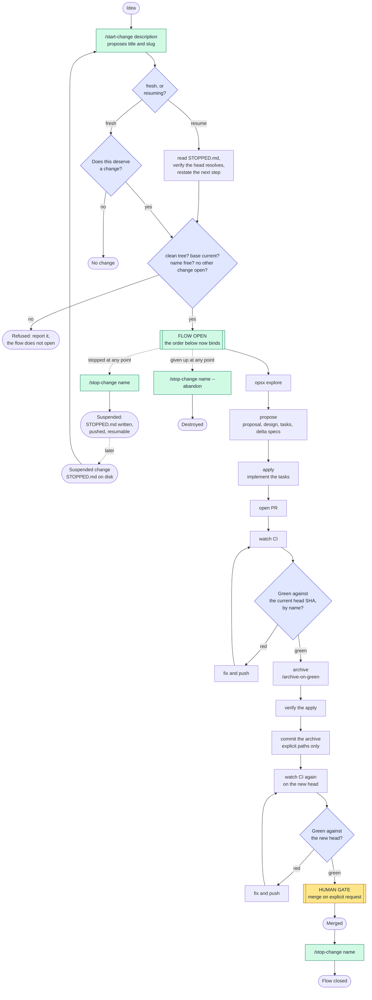
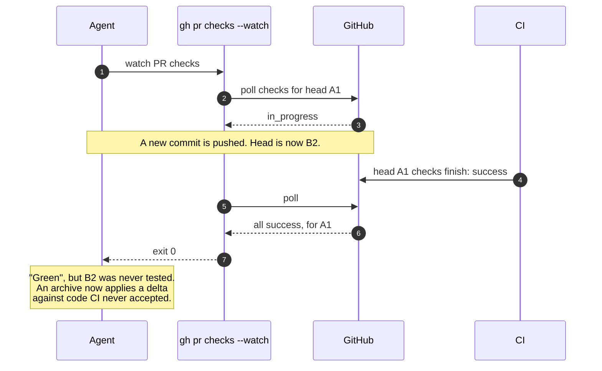
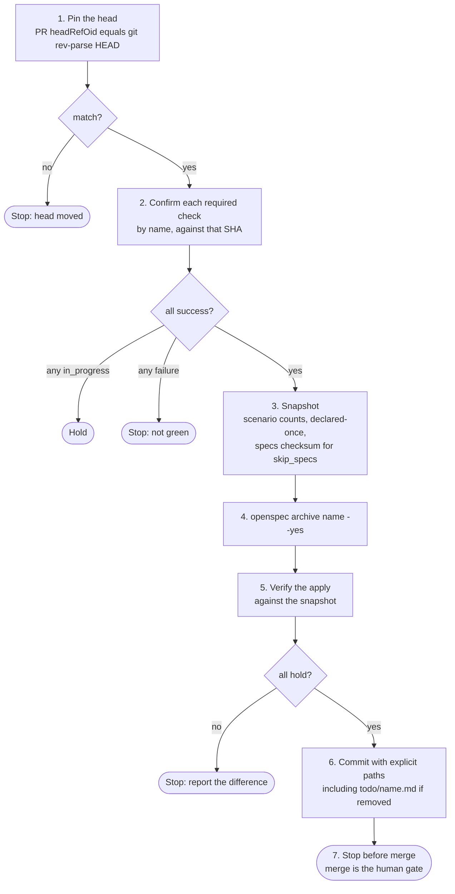
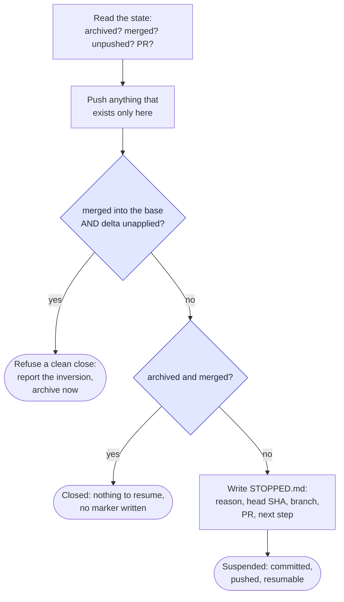
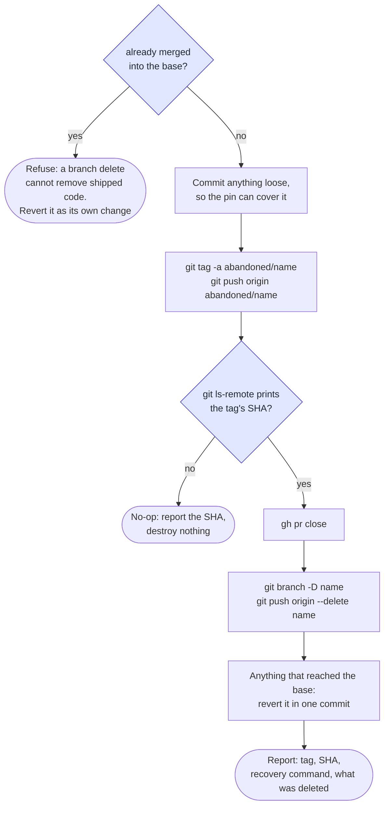
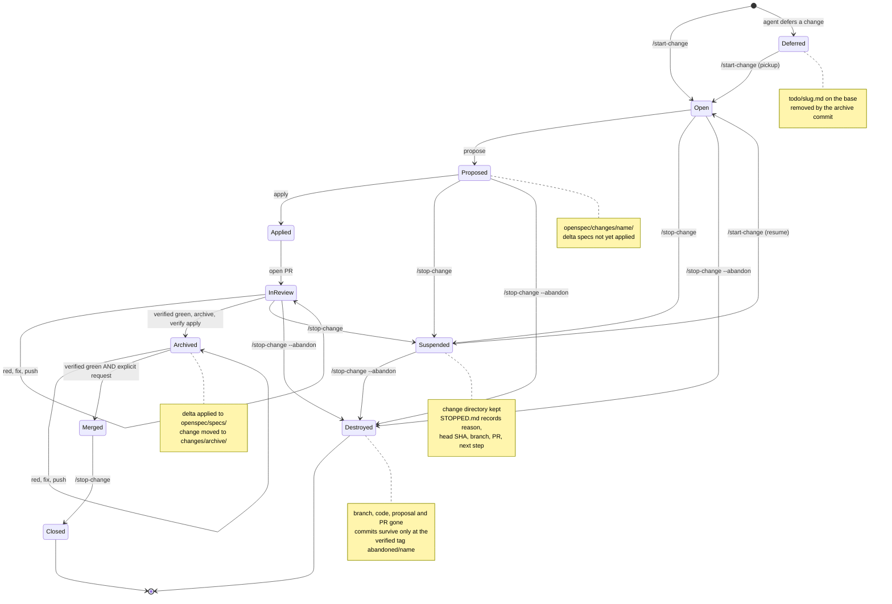

# The change flow

The flow is the path one OpenSpec change takes from idea to merged code. The
source of truth is the `openspec-change-flow` skill; this page draws it.

## The sequence



Two points need a person:

- **At the start**, "does this deserve a change at all?" is answered out loud.
  This is a judgement, and it is the decision that most often changes the
  outcome. `/start-change` is where it is answered.
- **At merge**, the change goes in only when someone asks for it.

Nothing between these two points stops to ask.

`/start-change` and `/stop-change` are the **brackets**. They do not interrupt
work; they say whether work is under way at all. Merge is the only gate *inside*
the brackets, and the count of stops per change in flight is unchanged from the
one-gate flow: one.

They also nest in time. A stop does not have to mean "finished": it can
**suspend**, recording the resume point in `openspec/changes/<name>/STOPPED.md`,
and the next `/start-change` consumes that marker and picks the work up. One
change can therefore be bracketed several times without ever asking "does this
deserve a change?" more than once — that question belongs to the open, not to
every interruption.

## Why one gate

This is not laxity. A repository that stopped twice per change — once before
committing, once before archiving — shipped a day of changes, and neither stop
ever changed anything. Reading back what each decision caught:

| decision | was it gated? | caught anything |
|---|---|---|
| does this deserve a change? | no | most of the time |
| is the implementation right? | yes | never |
| should this be archived? | yes | never |
| did I prove it or assume it? | no | every time |

The gates sat on decisions nobody was making. The archive gate could not do
better: an archive commit applies a delta and moves a folder, so it contains
nothing for a reader to judge. What the gate did instead was split one piece of
work into two states. After a push, "did you archive?" had to be asked, because
neither party knew which state the work was in.

The rule that comes out of it: **put a gate where a decision lives.**

Removing the archive gate moves the risk onto the automatic steps. The checker
and the definition of green below are what carry that risk.

### Why the brackets are not two more gates

The metric was never the number of stops. It was whether a decision lives at
each one, and the table names two decisions — the first row and the last. The
first row is the one `/start-change` puts a stop on; it was the *ungated* row
that caught something most of the time. The last is what `openspec-evidence`
exists for.

`/stop-change` adds no decision at all. It ends the ambiguity the archive gate
created. The archive gate's real defect was leaving work in a state nobody could
name, so *"did you archive?"* had to be asked; a stop that **refuses** to close
an unarchived change answers that by construction instead.

The gap they close is not hypothetical. With nothing marking the open, a change
began because an agent started behaving as though one had begun. In one session
that produced a change **merged first and archived afterwards**, in a second pull
request needing a second merge — inverting step 7 below and costing exactly the
extra gate this design exists to remove. The documented order was never
established as binding, because the flow was never explicitly opened.

## Opening the flow

(Resuming a change a stop suspended is the same command; it is covered
[below](#resuming-a-stopped-change).)

`/start-change <description>` takes a description of the work, not a name. From
it the command proposes a session title and a kebab-case change slug, or matches
the description to a change already open and resumes that one. Without a
description it asks for one and opens nothing. Nothing is inferred from the
conversation or the branch: a flow that can open itself is the state the bracket
exists to end. The slug is a proposal until `propose` writes it, so the user can
correct it before anything lands on disk.

The description is also matched against `todo/*.md`, the plans that deferred
changes left (see [Deferring a change](#deferring-a-change)). A match gives the
plan's slug and seeds `propose`. It does not answer the judgement below: a plan
says the work once deserved a change, and the open asks whether it still does.

After the judgement is answered out loud, four checks decide whether the flow can
open at all. Each is there because a later step would otherwise measure the wrong
thing, and none of them is a preference:

| refuses | detected by | because the later step that breaks is |
|---|---|---|
| a dirty tree | `git status --porcelain` | staging explicit paths — the rule only bites when there is unrelated work to sweep in |
| a base that has moved | `git rev-list --count HEAD..origin/<base>` | the `scenarios` check, which would compare the delta against a spec the merge result does not have |
| a slug already in `changes/archive/` (propose another) | `find openspec/changes -maxdepth 2 -type d -name '*<name>*'` | archive itself, whose folder is named after the change, so "was this applied?" stops being answerable by looking |
| a second concurrent change | `find openspec/changes -mindepth 1 -maxdepth 1 -type d ! -name archive` | `/archive-on-green`'s name inference, and the two-state ambiguity the archive gate produced |

A name found **outside** `changes/archive/` is a resume, not a refusal. The flow
reopens on the change already proposed rather than creating a second one.

Four checks that are deliberately absent, because adding every plausible one is
how a gate becomes something people work around:

- **green CI on the base** — gates this change on someone else's red, at the
  moment least able to fix it.
- **a pushed branch** — there is nothing to push yet. Pushing matters at abandon.
- **a `check-specs` run** — with no delta yet it passes with nothing to compare.
  A green that means nothing is worse than no check: it reads as reassurance.
- **`openspec` resolvable** — a precondition of the repository, not of this
  change, and it already fails loudly at `propose`.

## What "green" means

Archive runs when CI is green, without asking. So "green" has to be exact:

> Every required check reported `success` against the **current head SHA**,
> confirmed **by name**.

An exit code is not evidence. `gh pr checks --watch` exits 0 when the PR head is
replaced during the watch:



With a manual archive this was a nuisance. With archive triggered by green, it is
a correctness bug. The same hazard appears one layer up when polling: a poll
that reaches the API before it has registered runs for a new head sees the old
head's passes. If all checks arrive at once on the first poll, instead of one by
one, suspect this.

The procedure that replaces the exit code (`/verify-green`):

```bash
SHA=$(gh pr view <n> --json headRefOid -q .headRefOid)
[ "$SHA" = "$(git rev-parse HEAD)" ] || exit 1   # head moved under you
gh api "repos/<owner>/<repo>/commits/$SHA/check-runs" \
  -q '.check_runs[] | "\(.conclusion // .status)\t\(.name)"' | sort
gh pr view <n> --json mergeable,mergeStateStatus
```

Read the result as follows:

- Every check reads `success`, and the SHA matches local `HEAD`: green.
- Any check reads `in_progress` or `queued`: hold. Do not proceed.
- `mergeStateStatus: UNSTABLE`: checks are pending. Wait for `CLEAN`.

## Archive on green

`/archive-on-green` is the procedure for the archive step. Each step exists
because skipping it once caused a problem.



### Verify the apply, do not trust it

After `openspec archive`, check that:

- each requirement is declared **once**. Hand-editing a main spec produces a
  doubled requirement.
- a `MODIFIED` requirement still carries every scenario it had, plus the new
  ones.
- for a `skip_specs` change, the specs tree is **byte-identical**. Compare a
  checksum. Do not compare by eye.
- `openspec validate --specs --strict` passes, and the capability count is the
  expected one.
- the project's own `check-specs` run passes.

The archive commit also removes the plan the change started from, with
`git rm -q --ignore-unmatch -- todo/<name>.md`. It exits 0 when there is no plan,
so a change that never had one needs no special case.

Then commit the archive and let CI run again. That second CI cycle verifies the
only thing the archive commit changed.

### Stage explicit paths

Never `git add <dir>`. A directory add sweeps in unrelated in-flight change
folders. This happened once, and was caught only by reading the commit's file
list afterwards.

### Suggest slash commands as inline code

When a step tells the user to run a slash command, show it as inline code or in
an untagged fence, never in a `bash` fence. A shell-tagged block gets a Run
button, and a slash command run in a shell only fails. The skill's "Suggesting a
slash command" section has the incident, and the gates harness scans for it.

## Merge

Merge only on explicit request. Before merging, verify green by name against the
head SHA again — the archive commit is a new head. If the request comes while
checks are still running, say so and hold. The request is about intent, not
timing.

## Stopping the flow

`/stop-change <name>` **just stops**. It does not judge whether the change is
finished, and it never archives, merges or implements anything to make it look
finished — a stop reports the state it finds. Two outcomes, decided by that
state:



**What it refuses is narrow, and on purpose.** An unarchived change whose pull
request is still open is *not* refused: that is ordinary unfinished work, and
stopping is allowed to leave work unfinished. The refusal is a clean close over
the **inversion** — a merged pull request whose delta is still unapplied, which
is live code the specification still calls a proposal. That state gets reported
as the defect it is, with "archive now, in its own pull request" as the remedy.

It is the one refusal here with a receipt. In the session that produced this
command, a change was merged first and archived afterwards, in a second pull
request needing a second merge, inverting step 7 of `/archive-on-green` and
costing exactly the extra gate the one-gate design exists to remove.

**Why a marker rather than an inference.** `STOPPED.md` is
[principle 4](design.md#4-declare-intent-never-infer-it) applied to the flow
instead of to a spec. "A change directory with no session open" reads identically
for a change stopped deliberately, one being worked on another branch, and one
nobody has touched in a month. The marker distinguishes them, travels with the
branch, shows up in the pull request, and names the step to resume at.

**Why the push comes first.** A resume point that exists on one machine is the
`rescue/full-spike-work` failure in slow motion: the flow stops, the laptop is
closed, and the work can only be picked up where it was left.

## Resuming a stopped change

`/start-change <description>` is also the resume. A description that gives an
open change's slug, or plainly describes its work, selects that change; then what
is on disk decides, not a flag: a change directory under
`openspec/changes/<name>/` means resume, its absence means fresh.

- **"Does this deserve a change?" is not re-asked.** It was answered at the open.
  Re-asking it turns every interruption into a second gate, which is the
  twice-per-change flow this design rejected.
- **The recorded head must still resolve** (`git cat-file -e <SHA>^{commit}`). A
  marker naming a commit no ref reaches means the branch was deleted or the work
  never left another machine; resuming on top of that silently reopens the flow
  against a different state than the one that stopped. That is a refusal, and it
  reports where the SHA was last seen.
- **The marker is consumed by the resume that acts on it**, in the commit that
  resumes. A `STOPPED.md` left on a branch that is moving again says the opposite
  of the truth.
- **The open-time checks still apply** — clean tree, current base, no *other*
  change open. The second-change search excludes the resumed change's own name,
  which is the one place the same command means something different on the two
  ways in. A missing `STOPPED.md` with a change directory present is an
  interruption rather than a stop: say so, derive the state, and carry on.

## Abandoning a change

`/stop-change <name> --abandon` **destroys** a change. The proposal, the
implementation code, the branch and the pull request all leave the working
repository, which ends up as though the change had never been opened. It
requires the name explicitly: every other step reads state, this one deletes
branches and code, and inferring *which* change is how the wrong work gets
destroyed.

Destructive is the point. *Silently* destructive is the failure, and the two are
told apart by one command — so the ordering is **pin, verify the pin, then
destroy**:



What each step buys:

- **Loose work is committed, never discarded.** An uncommitted file cannot be
  tagged, and the delete two steps later would take it. It goes onto the branch
  that is about to be pinned, however unfinished.
- **The tag is mandatory, not a fallback, and it is verified on the remote.** It
  is the single survivor, and it is what makes `git branch -D` and
  `git push origin --delete` safe rather than reckless. A spike in the consumer
  repository survived as six commits on a local branch and nothing else — no
  remote, no pull request, no tag — so recovering it needed the machine it was
  written on. An unverified push is that state with a tag name on it, which is
  why a failed `git ls-remote` makes the whole command a no-op.
- **Recovery is one command, and it is printed in the report:**

  ```bash
  git fetch origin 'refs/tags/abandoned/<name>:refs/tags/abandoned/<name>'
  git checkout -b <name>-recovered abandoned/<name>
  ```

- **Code that reached the base is reverted explicitly.** Deleting a branch does
  not remove what is no longer only on it, so a partial push or a shared branch
  is reverted in one commit and named in the report.
- **The change directory is never archived.** `openspec archive` applies the
  delta to `openspec/specs/`, publishing an accepted requirement for a change
  nobody accepted — and a spec describing behaviour no code implements passes
  every check in this package, because none of them read application code.
- **The plan is left alone.** If the change started from `todo/<name>.md`, that
  plan was on the base before the open, and abandon restores "never opened".

Already-merged work cannot be abandoned at all: the code is in the base, and no
branch delete removes it. Reverting shipped behaviour is a change of its own,
with its own delta and its own review.

## Deferring a change

A change an agent recommends for later, instead of doing now, is written to
`todo/<slug>.md` at the repository root. A follow-up proposed only in the
transcript dies with the session. The skill's "Deferring a change" section has
the format and the threshold: a recommendation, not a passing mention.

A plan is a seed, not a proposal. It creates nothing under `openspec/changes/`,
so it never counts as a second active change. It is committed by explicit path
(`chore(todo): defer <slug>`), so it survives a machine change and blocks no
later open with a dirty tree.

Its whole life is three commands:

| step | what happens to `todo/<slug>.md` |
|---|---|
| an agent defers a change | written and committed |
| `/start-change` matches it | its slug becomes the change slug; it seeds `propose` |
| `/archive-on-green` | removed in the archive commit |

`/stop-change --abandon` leaves it alone. The plan existed before the change was
opened, and abandon restores "never opened".

## How the brackets were watched refusing

The gates are prose instructions, so "watch it fail first" cannot mean running
them and seeing red. What it does mean here: every refusal a gate claims must
rest on a condition that a command can **observe**, and that command must say
something different in the refusing state than in the adjacent permitting one.

`scripts/gates/refusal-cases.sh` (`npm run test:gates`, and a CI job) builds each
refusing state in a throwaway repository and reports both directions of every
boundary — 26 observations over git and the filesystem alone, with no network, no
`gh` and no `openspec`. It covers the dirty tree, the moved base, the reused name
(and the resume it must be told apart from), the second open change, the resume
that must not count itself, the suspend and its marker, a recorded head that no
longer resolves, the marker's consumption, the inversion, loose work at abandon,
a tag that exists only locally, a tag verified on the remote, and work already
merged.

`--abandon` also gets one observation that is not a refusal, because its design
is a claim about what survives destruction: the harness deletes both branches and
then restores the work from the tag **in a clone that never had the branch**.

Watched failing before being trusted, six mutations:

| mutation | reddens |
|---|---|
| name search narrowed to `-maxdepth 1` | the two observations that read it, and nothing else |
| the abandon pin checked with `git tag -l` instead of `git ls-remote` | the local-only-tag refusal |
| the tag push skipped while the destroy still runs | the pin check **and** the recovery — `rescue/full-spike-work` reproduced on demand |
| the resume marker stubbed to always be present | the "no marker before a stop" and "marker consumed by the resume" observations |
| the recorded head stubbed to always resolve | the unreachable-resume-point refusal |
| the second-change search no longer excluding the resumed name | the observation that a resume does not count itself |

The third mutation also found a defect in the harness itself: the recovery
checkout sat above its `if`, so under `set -e` a missing tag killed the run
instead of reporting a failure. One failure and no summary is what that looks
like, and it is why the checkout is now inside the condition.

The run prints what it does not cover, so a green is not read as more than it is:
the "does this deserve a change?" judgement, which no command decides; the
pull-request states, which need a live GitHub; reverting code that reached the
base, which is an ordinary `git revert` behind a refusal the harness does cover;
and whether an agent obeys a refusal it can see. Observability is necessary, not
sufficient.

## Where each state lives



`check-specs` inspects only **unarchived** changes. Before archive, the
`scenarios` check compares each delta with the live spec. After archive, the
delta is history, and the `duplicates` and `strict` checks cover the applied
result.
